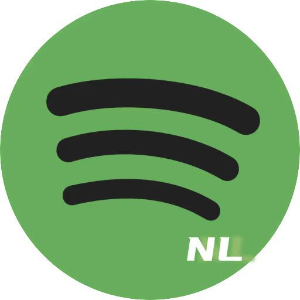

# NLSpotify

[](https://developer.apple.com/ios/)
[](https://developer.apple.com/documentation/objectivec)
[](https://cocoapods.org/)

一款仿 Spotify 风格的 iOS 音乐流媒体应用，由网易云音乐 API 提供音乐内容支持。纯 Objective-C 开发，提供流畅、美观且功能完整的音乐收听体验。

## 应用截图

| 主页 | 搜索 | 音乐库 | 播放器 |
|:---:|:---:|:---:|:---:|
|  |  |  |  |

## 功能特性

- **发现音乐** — 浏览个性化推荐、新歌速递和热门歌单
- **强大搜索** — 搜索建议 + 分类浏览 + 品类精选歌单，快速找到想听的音乐
- **高清播放与歌词同步** — 支持高品质音乐播放，逐行精准同步歌词显示
- **智能缓存与预加载** — 基于 AVAssetResourceLoader 的流式缓存，支持断点续传，无缝播放切换
- **离线收听** — 歌曲下载管理，随时随地享受音乐
- **WCDB 本地化存储** — 腾讯 WCDB 实现高效本地数据持久化（歌曲/歌单/专辑/下载/搜索记录）
- **动态评论区** — 自适应高度、动态展开/折叠
- **双 Token 认证** — 自动检测 401/301 → Token 刷新 → 请求重试，保障会话安全
- **歌单管理** — 创建私人歌单、收藏音乐、管理播放历史
- **侧边栏抽屉** — 用户信息与快捷操作入口

## 架构设计

```
┌─────────────────────────────────────────────┐
│                  UI Layer                    │
│  Controllers + Views (Masonry AutoLayout)    │
├─────────────────────────────────────────────┤
│               ViewModel Layer                │
│  NLHomeViewModel / NLSectionViewModel        │
├─────────────────────────────────────────────┤
│              Service Layer                   │
│  NLSongService / NLPlaylistService / ...     │
│  NetWorkManager (AFNetworking)               │
│  NLAuthManager (双 Token 认证)                │
├─────────────────────────────────────────────┤
│             Repository Layer                 │
│  NLSongRepository / NLPlayListRepository     │
│  NLAlbumRepository / NLDownloadRepository    │
├─────────────────────────────────────────────┤
│              Storage Layer                   │
│  WCDB.objc (SQLite ORM)                      │
│  NLCacheManager (磁盘缓存 + LRU)             │
└─────────────────────────────────────────────┘
```

**模式:** MVC + ViewModel 混合 | **信号驱动:** ReactiveObjC 管理播放器状态

### 项目结构

```
NLSpotify/
├── App/                    # AppDelegate, SceneDelegate, TabBar, Login
├── Modules/
│   ├── 主页面/             # 首页推荐（ViewModel + Cell + 抽屉视图）
│   ├── 搜索页面/           # 搜索建议 + 搜索结果 + 品类歌单
│   ├── 歌单详情页/         # 歌曲列表 + HeaderView + 添加到歌单
│   ├── 播放器/             # 全屏播放 + 迷你播放器 + 缓存 + 下载
│   ├── 评论区/             # 评论列表 + 文本折叠
│   ├── 音乐库/             # 音乐库首页 + 创建歌单 + 播放历史
│   ├── Advertise/          # 广播模块
│   ├── Create/             # 歌单创建
│   └── WCDB/               # 数据库管理 + Repository + ORM 模型
├── Networking/
│   └── 网易云API/          # API Service 层 + 双 Token 认证
├── Assets.xcassets/        # 图标与颜色资源
└── Resources/              # 应用截图
```

## 技术栈

| 分类 | 技术 | 说明 |
|:---:|:---:|:---|
| 网络 | [AFNetworking](https://github.com/AFNetworking/AFNetworking) | HTTP 请求 + 网络状态监听 |
| 响应式 | [ReactiveObjC](https://github.com/ReactiveCocoa/ReactiveObjC) | 播放器状态信号驱动 |
| 布局 | [Masonry](https://github.com/SnapKit/Masonry) | AutoLayout DSL，纯代码布局 |
| 图片 | [SDWebImage](https://github.com/SDWebImage/SDWebImage) | 异步图片加载与内存/磁盘缓存 |
| 数据库 | [WCDB.objc](https://github.com/Tencent/wcdb) | 腾讯 ORM 数据库框架 |
| 音频 | [HysteriaPlayer](https://github.com/hust201010701/HysteriaPlayer) | iOS 音频播放引擎 |
| UI 组件 | [JXCategoryView](https://github.com/pujiaxin33/JXCategoryView) | 分段控制器 / 标签页 |
| 模型 | [YYModel](https://github.com/ibireme/YYModel) | 高性能 JSON ↔ Model |
| WebSocket | [SocketRocket](https://github.com/facebookincubator/SocketRocket) | WebSocket 通信 |
| 键盘 | [IQKeyboardManager](https://github.com/hackiftekhar/IQKeyboardManager) | 键盘自动避让 |
| 调试 | [LookinServer](https://github.com/nicklockwood/LookinServer) | UI 层级调试（仅 Debug） |

## 安装与运行

**环境要求:** Xcode 14+、CocoaPods、iOS 13.0+

```bash
# 1. 克隆仓库
git clone https://github.com/TommyWu-LGR/NLSpotify.git
cd NLSpotify

# 2. 安装依赖
pod install

# 3. 打开项目（必须使用 .xcworkspace）
open NLSpotify.xcworkspace

# 4. 选择模拟器或真机，Cmd+R 运行
```

> **注意:** 始终使用 `.xcworkspace` 打开项目，不要使用 `.xcodeproj`。

## 使用指南

1. 在 **主页** 浏览推荐歌单和专辑，点击左上角头像可打开侧边栏
2. 切换到 **搜索** 标签页，输入关键词搜索或浏览分类歌单
3. 点击歌曲播放，底部出现迷你播放器，点击展开全屏查看歌词
4. 在歌单详情页可下载歌曲、添加到歌单或查看评论
5. 在 **音乐库** 管理收藏、下载和播放历史

## API 说明

音乐数据来源于 [网易云音乐 API](https://binaryify.github.io/NeteaseCloudMusicApi/)，通过腾讯云函数代理访问。

核心 Service：

| Service | 功能 |
|---|---|
| `NLSongService` | 获取歌曲播放 URL |
| `NLPlaylistService` | 获取歌单详情 |
| `NLSongListService` | 获取歌单歌曲列表 |
| `NLAlbumService` | 获取专辑信息 |
| `NLCommentService` | 获取评论数据 |
| `NLSearchSuggestService` | 搜索建议 |
| `NLRecommendAlbumListService` | 推荐歌单 |
| `NLChineseSongListService` | 中文歌曲列表 |
| `NLSingerAlbumListService` | 歌手专辑列表 |
| `NLAuthService` | Token 获取/刷新 |
| `NLGuestLoginService` | 游客登录 |

## 贡献指南

1. Fork 本仓库
2. 创建功能分支 (`git checkout -b feature/AmazingFeature`)
3. 提交更改 (`git commit -m 'Add some AmazingFeature'`)
4. 推送到分支 (`git push origin feature/AmazingFeature`)
5. 提交 Pull Request

## 许可证

本项目采用 [MIT License](LICENSE) 许可证。
